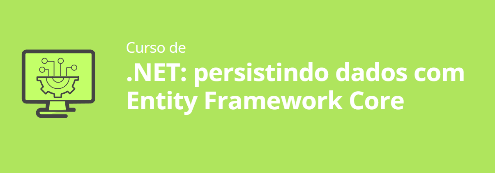

<h1>Objetivos</h1>
<ul>
    <li>Aprenda a incluir persistência de dados em um projeto já existente.</li>
    <li>Conheça ADO.NET e Entity Framework e aprenda como aplicar no projeto.</li>
    <li>Aprenda a criar seus próprios genéricos em C#.</li>
    <li>Entenda o que são migrations e como utilizá-las para gerenciar as versões do banco de dados.</li>
    <li>Pratique refatoração para otimização de recursos e utilização de um código legível.</li>

</ul>

<h1>Aprendizado do Curso</h1>
Durante o curso, adquiri conhecimentos valiosos sobre a integração de bancos de dados em aplicações .NET, com foco na utilização do SQL Server e do Entity Framework.
 
O que foi aprendido ao longo das aulas:

1. Conectando SQL Server à Aplicação
Na primeira aula, aprendi a estabelecer a conexão entre o SQL Server e nossa aplicação, o que é essencial para manipular dados de maneira eficiente.

2. Introdução ao Entity Framework e ORM
Na segunda aula, exploramos o conceito de ORM (Object-Relational Mapping) e começamos a utilizar o Entity Framework no projeto, facilitando a interação com o banco de dados de forma mais intuitiva.

3. Aplicação de Generics
A terceira aula foi dedicada ao estudo de Generics, aplicados para otimizar o código e tornar as classes mais flexíveis e reutilizáveis dentro do projeto.

4. Trabalhando com Migrations
Na quarta aula, aprendi a utilizar Migrations, uma ferramenta fundamental para gerenciar versões do banco de dados e aplicar mudanças de forma controlada e segura.

5. Relacionamento entre Tabelas
Na última aula, aprofundei meus conhecimentos sobre relacionamentos entre tabelas, garantindo a integridade e a consistência dos dados no banco.

Com esses aprendizados, finalizei o curso com a aplicação Screen Sound completamente funcional, agora capaz de salvar e gerenciar informações de artistas e músicas diretamente no banco de dados, algo que antes era perdido a cada nova execução da aplicação.